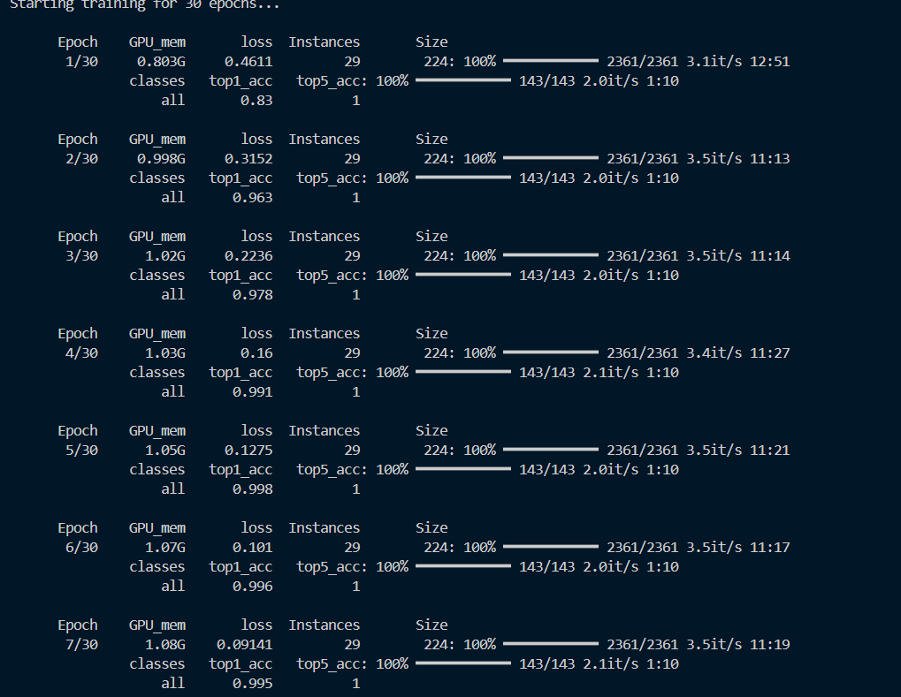
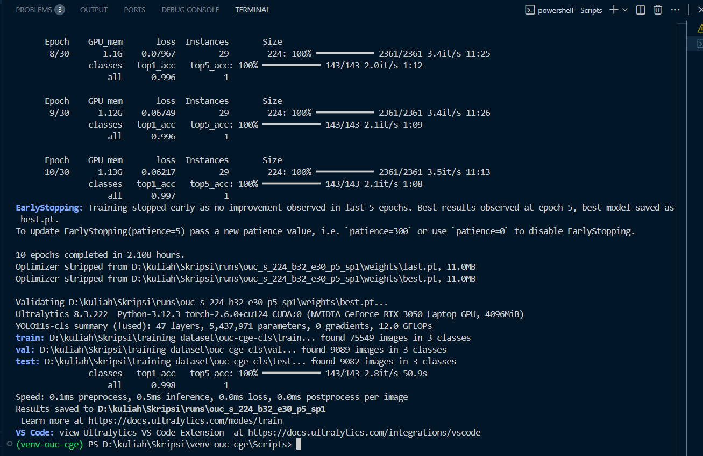
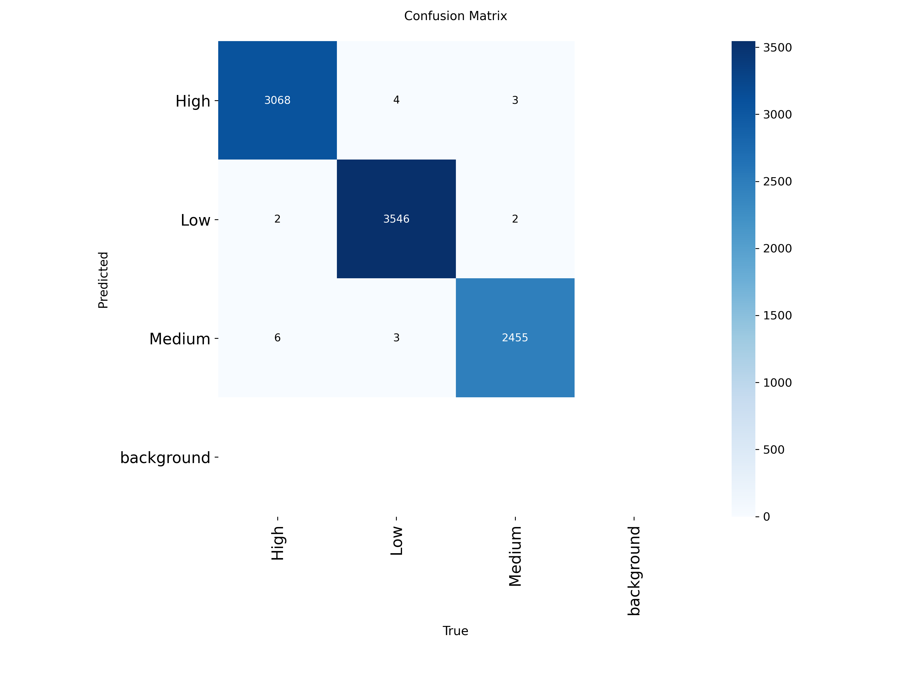
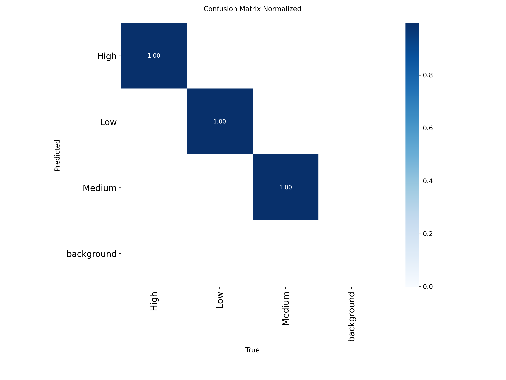
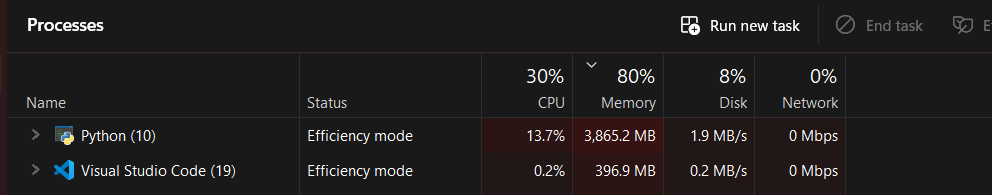

# Hasil Training OUC-CGE dengan YOLOv11 small 
<p>Laporan Progress! Jadi apa yang saya lakukan? Sederhananya

- Frame extraction <br>
- Training  <br>
- Evaluasi
<p>

## 0. Spesifikasi dan Environment
- Laptop: i5-12500H, RAM 16 GB, RTX 3050 4 GB VRAM (driver 577.03, CUDA 12.9).
- Python: 3.12 (virtual env: venv-ouc-cge).
- Folder dataset sumber (video):
F:\OUC-CGE dataset\{high, med, Low}
- Folder kerja:
D:\kuliah\Skripsi\training dataset\ (data keluaran & skrip)
D:\kuliah\Skripsi\runs\ (hasil training/evaluasi)
### Aktivasi env & instalasi paket
```
D:\kuliah\Skripsi\venv-ouc-cge\Scripts\Activate.ps1
# Torch CUDA (cu124). Jika gagal/404, ganti ke cu121.
pip uninstall -y torch torchvision torchaudio
pip install --index-url https://download.pytorch.org/whl/cu124 torch torchvision torchaudio
```
```
pip install --upgrade pip
pip install ultralytics opencv-python imageio imageio-ffmpeg decord av
```
Cek CUDA
```
import torch
print("CUDA available:", torch.cuda.is_available())
print("CUDA version  :", torch.version.cuda)
if torch.cuda.is_available():
    print("Device        :", torch.cuda.get_device_name(0))


CUDA available: True
CUDA version  : 12.4
Device        : NVIDIA GeForce RTX 3050 Laptop GPU
```

## 1. Ekstraksi frame dari video
<p> Tujuan: membentuk dataset image classification dari video OUC-CGE.  <br>
 <br>
- TARGET_FPS = 2 (cukup untuk cue engagement)<br>
- FRAMES_CAP_PER_VIDEO = 12 (maks 12 frame/video) kenapa cuma 12? karena memang 1 video durasinya pendek<br>
- JPEG_QUALITY = 85<br>
- SKIP_IF_EXISTS = True (bisa di-resume tanpa duplikasi)<br>
- Output otomatis membuat train/val/test per kelas dan log bad_videos.txt bila ada file korup.
</p>

Ada di file [extract_ouc_cge_frames.py](extract_ouc_cge_frames.py)


**Hasil Struktur dari Ekstraksi Frame**
```
D:\kuliah\Skripsi\training dataset\ouc-cge-cls\
  train\{Low,Medium,High}
  val\{Low,Medium,High}
  test\{Low,Medium,High}
  bad_videos.txt   # otomatis jika ada video gagal dibaca
  ```
## 2. Training Klasifikasi (YOLO11s-cls)
```
Konfigurasi: imgsz=224, batch=32, optimizer=AdamW (lr0=0.003), AMP (hemat VRAM), device=0 (GPU), early-stopping.
```
**Penjelasan konfigurasi**
<p>
- imgz=224 (image size by px) <br>
Hemat VRAM detail tidak terlalu pecah <br>
- batch=32 (jumlah gambar per iterasi) <br>
  32 karena Alhamdulillah laptop saya kuat batch segini <br>
-  Patience 5 agar early stopping semisal tidak improve 5 epoch berturut turut, ini dipantau dari val accuracy/loss<br>
  
</p>

**Run** <br>
```
yolo task=classify mode=train resume=False `
  model=yolo11s-cls.pt `
  data="D:\kuliah\Skripsi\training dataset\ouc-cge-cls" `
  epochs=30 patience=5 save_period=1 `
  imgsz=224 batch=32 optimizer=AdamW lr0=0.003 `
  amp=True device=0 workers=4 `
  project="D:\kuliah\Skripsi\runs" name="ouc_s_224_b32_e30_p5_sp1"

```
<br>
Outcome training

Target 30 epoch, early-stop di epoch 10 (best epoch 5 dan tidak ada improvement signifikan).

Train/Val/Test count (gambar): 75,549 / 9,089 / 9,082 (3 kelas).

Training sudah plateau cepat (ep1 0.83 → ep5 ~0.998).

Saya sempat menjalankan run 60 epoch & pause di ~18/60 dengan patience 12, tapi tidak terlalu efektif karena sebenarnya sudah plateau dan epoch 60 akan memakan waktu sangat lama <br> Dan ini 10 Epoch saja sudah sekitar 2 jam dan 18 epoch sebelumnya hampir 3.5 jam<br>

**Hasil Run** <br>

<br>



## 3. Evaluasi
### Val & Test (CLI Ultralytics)
```
# Val (default)
yolo task=classify mode=val `
  model="D:\kuliah\Skripsi\runs\ouc_s_224_b32_e30_p5_sp1\weights\best.pt" `
  data="D:\kuliah\Skripsi\training dataset\ouc-cge-cls" `
  device=0 project="D:\kuliah\Skripsi\runs" name="val_e30"

# Test eksplisit
yolo task=classify mode=val `
  model="D:\kuliah\Skripsi\runs\ouc_s_224_b32_e30_p5_sp1\weights\best.pt" `
  data="D:\kuliah\Skripsi\training dataset\ouc-cge-cls" split=test `
  device=0 project="D:\kuliah\Skripsi\runs" name="val_test_e30"

```

<br> 

**Hasil Utama** <br>
```
Val Top-1 ≈ 0.998
Test Top-1 = 0.99
```

### Confusion Matrix 
 
<br>
F1 per kelas (val) (≈):

High: 0.9976 | Low: 0.9984 | Medium: 0.9972

Macro-F1 (val) ≈ 0.9977

Kesalahan residu paling umum: Medium ↔ High (wajar, perbedaan visual halus)

## 4. Prediksi Demo
<p>Ada 2 opsi, yakni masing masing kelas atau wildcard. Untuk ini saya menggunakan wildcard  </p>

```
# Prediksi per kelas
yolo task=classify mode=predict `
  model="D:\kuliah\Skripsi\runs\ouc_s_224_b32_e30_p5_sp1\weights\best.pt" `
  source="D:\kuliah\Skripsi\training dataset\ouc-cge-cls\test\High" `
  device=0 project="D:\kuliah\Skripsi\runs" name="demo_predict_high"

# atau, semua kelas (rekursif wildcard)
yolo task=classify mode=predict `
  model="D:\kuliah\Skripsi\runs\ouc_s_224_b32_e30_p5_sp1\weights\best.pt" `
  source="D:/kuliah/Skripsi/training dataset/ouc-cge-cls/test/**/*.jpg" `
  device=0 project="D:\kuliah\Skripsi\runs" name="demo_predict_all"

```

##
Terima kasih! Progress ini dikerjakan pada 29 oktober - 31 Oktober 2025 
##
Saya pede pakai yolov11s (small bukan yang nano) karena memakai small mem usage nya masih under 4gb
